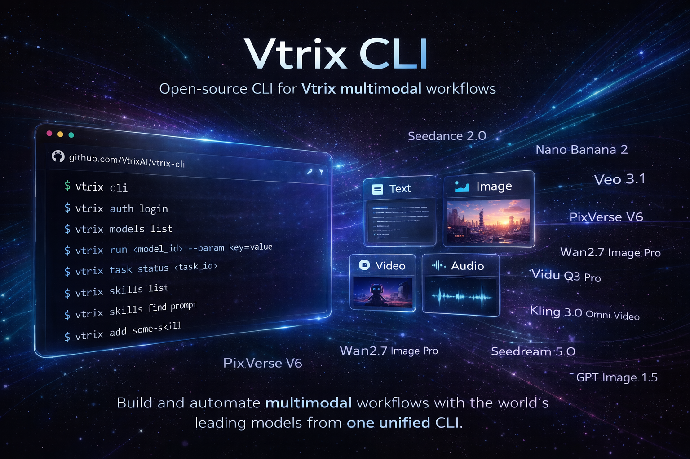

<div align="center">
  <p>
    
  </p>
  <h1>Vtrix CLI</h1>
  <h3>The official CLI for the Vtrix AI Platform</h3>
  <p>
    Built for AI agents. Authenticate, browse models, submit multimodal tasks,
    track task status, and manage SkillHub skills from any agent or terminal.
  </p>
  <p>
    <a href="https://www.npmjs.com/package/@vtrixai/vtrix-cli">
      
    </a>
    
    = 18">
    = 1.26">
  </p>
  <p>
    <a href="./README.zh.md">中文文档</a>
    ·
    <a href="https://vtrix.ai/">Official Website</a>
  </p>
</div>

## Features

- **Authentication**: Sign in with the browser-based device flow and store credentials locally.
- **Model discovery**: List available models and inspect full parameter specs in human-readable or JSON form.
- **Task execution**: Submit multimodal generation tasks from the CLI with parameter validation and structured output options.
- **Task tracking**: Poll task status and print result URLs or full JSON responses.
- **SkillHub integration**: Search, install, and configure agent skills from Vtrix SkillHub.
- **Agent-friendly UX**: Supports `--dry-run`, JSON output, stable command shapes, and copy-pasteable examples.

## Install

### Install with npm

```bash
npm install -g @vtrixai/vtrix-cli
```

> Requires Node.js 18+

### Install from source

Default install:

```bash
git clone https://github.com/VtrixAI/vtrix-cli.git
cd vtrix-cli
make install
```

> Requires Go 1.26+
> The installed binary uses the default service endpoints for the public CLI. You can override them with `VTRIX_BASE_URL`, `VTRIX_MODELS_URL`, `VTRIX_GENERATION_URL`, and `VTRIX_SKILLHUB_URL`.

If `/usr/local/bin` requires elevated permissions:

```bash
sudo make install
```

If you prefer a user-local install without `sudo`:

```bash
make install PREFIX=$HOME/.local
export PATH="$HOME/.local/bin:$PATH"
```

### Download binaries

Prebuilt binaries are published on the [Releases](https://github.com/VtrixAI/vtrix-cli/releases) page for:

- macOS `amd64`
- macOS `arm64`
- Linux `amd64`
- Linux `arm64`
- Windows `amd64`

## Quick Start

### Authenticate

```bash
vtrix auth login
vtrix auth status
```

### Browse models

```bash
vtrix models list
vtrix models list --type video
vtrix models spec kirin_v2_6_i2v
vtrix models spec kirin_v2_6_i2v --output json
```

### Run a task

```bash
vtrix run kirin_v2_6_i2v --param image=https://example.com/cat.jpg
vtrix run kirin_v2_6_i2v --param prompt="a cat running" --param duration=5
vtrix run kirin_v2_6_i2v --param mode=pro --output url
```

### Check task status

```bash
vtrix task status <task_id>
vtrix task status <task_id> --output url
vtrix task status <task_id> --output json
```

### Manage skills

```bash
vtrix skills list
vtrix skills find prompt
vtrix skills add some-skill
vtrix skills config --show
```

## Commands

### `vtrix auth`

```bash
vtrix auth login
vtrix auth status
vtrix auth logout
vtrix auth set-key <api-key>
```

### `vtrix models`

```bash
vtrix models list
vtrix models list --keywords kirin
vtrix models list --output id
vtrix models spec <model_id>
vtrix models spec <model_id> --output json
```

### `vtrix run`

```bash
vtrix run <model_id> --param key=value
vtrix run <model_id> --param prompt="hello" --param duration=5
vtrix run <model_id> --output json
```

Nested fields use dot notation:

```bash
vtrix run some_model \
  --param camera_control.type=simple \
  --param camera_control.speed=2
```

### `vtrix task`

```bash
vtrix task status <task_id>
```

### `vtrix skills`

```bash
vtrix skills list
vtrix skills find [query]
vtrix skills add <slug>
vtrix skills config --show
```

### `vtrix version`

```bash
vtrix version
```

## Output and Automation

- Use `--output json` where supported for machine-readable responses.
- Use `--output url` on task commands to print only result URLs.
- Use global `--dry-run` to inspect execution without sending requests.

Example:

```bash
vtrix --dry-run run kirin_v2_6_i2v --param prompt=test
```

## Release

Release assets are built from source and published to GitHub Releases.  
The npm package downloads the matching prebuilt binary for the user platform during installation.

If you maintain releases manually, the repository includes:

- `scripts/build.sh`
- `.goreleaser.yml`
- `scripts/set-release-version.js`

## Repository Layout

```text
vtrix-cli/
├── cmd/                # CLI command definitions
├── internal/auth/      # Auth client and login flow
├── internal/models/    # Model list and spec APIs
├── internal/generation/# Task submit and polling
├── internal/skillhub/  # SkillHub client and install logic
├── package.json        # npm package manifest
├── scripts/            # Build, release, and npm wrapper scripts
└── skills/             # Built-in skill definitions
```

## Contributing

Issues and pull requests are welcome. Before sending larger changes, it is best to open an issue first so the scope can be discussed.

For local verification:

```bash
go test ./...
go run . --help
```
